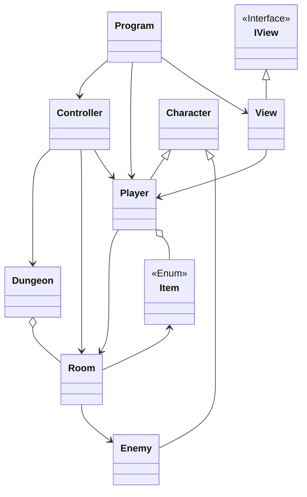
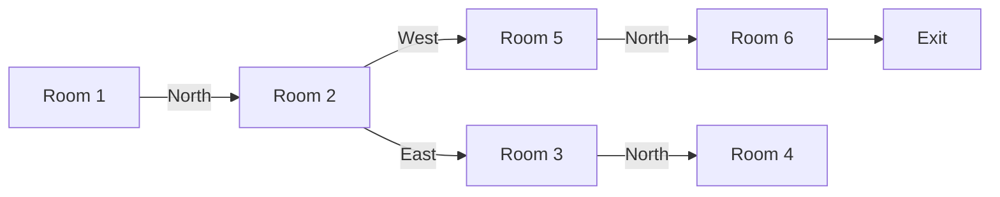

# Yet Another Dungeon Crawler

## Authors

+ João Fernandes - 22304583
+ Inês Gomes - 22305790

We were both working on most things together, where one would do part of it and the other would finish and/or fix it. There wasn't exactly a defined role.

## Sln Architecture

This solution was built following the MVC approach, our model includes the classes Character, Player, Enemy, Item, Dungeon and Room.
Character is the base class for Player and Enemy and ensures they both have AttackPower and HP and that they both can Attack a target.
Player has an Inventory(Dictionary) of Items and knows what Room he's in.
Dungeon has a List of Rooms.

The Controller handles the game loop. Our game has no menus, it simply presents a situation and expects a keyword from the player that fits the situation. These are the recognized keywords:

+ Attack: this command will try to find an Enemy in the same room that still has HP and attack it, the enemy will attack in return if it is still alive after the hit
+ Pick Up: this command will try to find an item in the current room and move it into the players inventory
+ Heal: this command will heal the player if its health isn't full and he has a Healing Potion in his inventory, spending it in the process
+ North,West,South,East: these directional commands will try to move the player to an adjacent room in that direction, Rooms have a Dictionary of exits that have these directions as keys and the Room ID of the adjacent room as a value
+ Exit: if the player is at a Room marked as the Exit of the Dungeon this command will allow him to escape
+ Give Up: the player can end his adventure early by typing this command
+ Map: this command displays the map of the dungeon again

The Directional and Exit commands will not work if there's an active enemy in the room.

The Pick Up and Heal commands will trigger an enemy attack if done while there's an active enemy in the room.

If the Exit command is successful, the player Gives Up or has his health dropped to 0 the game ends.

The View class implements the IView interface, it handles the reading of Files and output of status messages, most of the methods are self explanatory.

The ReadRoomConfig method is of some note as we use the Json.Net library to deserialize a JSON file into the Rooms that compose the dungeon. If the File is not found it returns an empty list and an error message.

### Class Diagram

### Map

## References

We use a JSON file to contain the information about the different rooms of the dungeon, in order to deserialize this file and load the data into the Room objects we used the [Json.NET](https://www.newtonsoft.com/json) library that has a very useful static method called with JsonConvert.DeserializeObject\<T\>(String) that basically takes the JSON as a string and converts it into a T type object. I found out about it using this [StackOverflow question](https://stackoverflow.com/questions/1207731/how-can-i-deserialize-json-to-a-simple-dictionarystring-string-in-asp-net).

We change the color of the command line which we used this [StackOverflow question](https://stackoverflow.com/questions/38431068/how-to-display-formatted-output-in-different-colors-using-console-writeline) to figure out how to do it.
