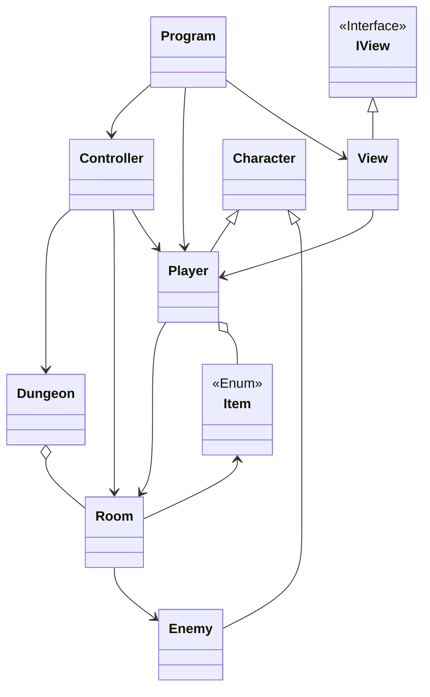
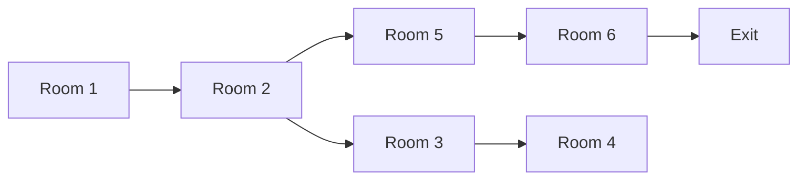

# Yet Another Dungeon Crawler

## Authors

+ João Fernandes - 22304583
+ Inês Gomes - 22305790

<!---
Add here what each of us did
-->

## Sln Architecture

<!---
Add here the description of the sln, how it was organized and the non trivial algorithms used
-->

### Class Diagram

### Map

## References

We use a JSON file to contain the information about the different rooms of the dungeon, in order to deserialize this file and load the data into the Room objects we used the [Json.NET](https://www.newtonsoft.com/json) library that has a very useful static method called with JsonConvert.DeserializeObject\<T\>(String) that basically takes the JSON as a string and converts it into a T type object. I found out about it using this [StackOverflow question](https://stackoverflow.com/questions/1207731/how-can-i-deserialize-json-to-a-simple-dictionarystring-string-in-asp-net).

[Text on link](Map.txt)
