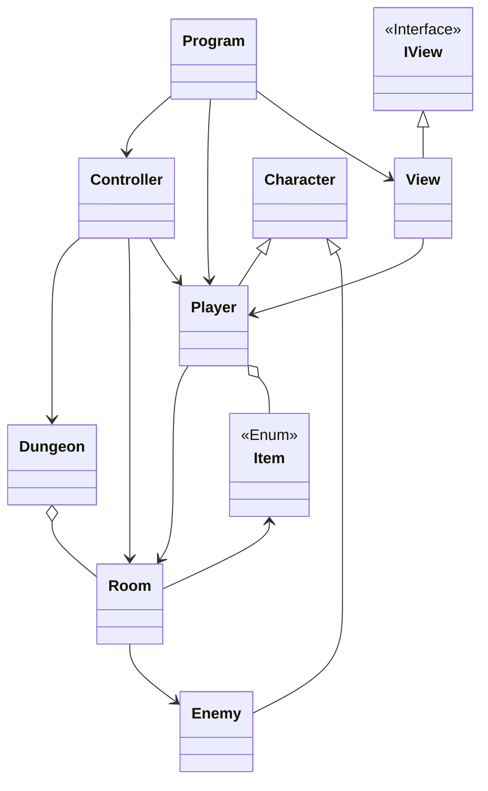

# Yet Another Dungeon Crawler

## Authors

+ João Fernandes - 22304583
+ Inês Gomes - 22305790

<!---
Add here what each of us did
-->

## Sln Architecture

<!---
Add here the description of the sln, how it was organized and the non trivial algorithms used
-->

### Class Diagram

### Map

<!---
Add Map Here
-->

## References
